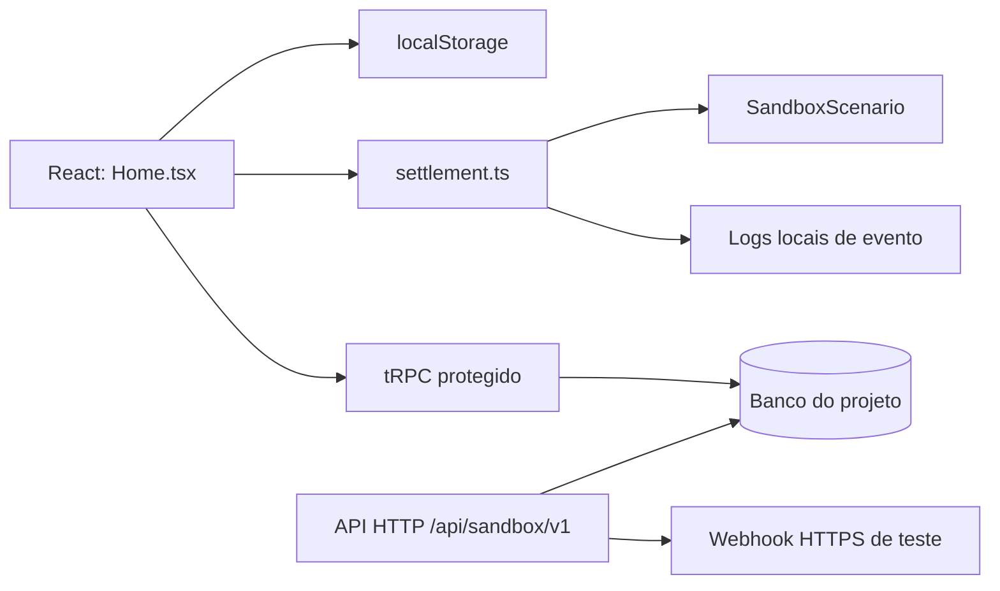

# Documentação Técnica — OptmaPay Sandbox

**Projeto:** `optmapay-sandbox`  
**Escopo:** internet banking fictício para desenvolvimento, testes de vendas, cobranças e liquidação simulada.  
**Regra central:** o projeto não se conecta a instituições financeiras, não processa dinheiro real e não deve receber dados de produção.

> Todos os valores, correntistas, cartões, Pix, boletos, pedidos, transações e eventos são dados de teste. O servidor e a interface identificam explicitamente o ambiente como `sandbox` e retornam `realMoney: false` nas rotas HTTP. [1] [2]

## 1. Visão da arquitetura

O webapp combina uma interface React responsiva, regras de liquidação puras no cliente, persistência local no navegador e persistência opcional no banco do projeto quando o operador está autenticado. Há também uma API HTTP para integrações de teste e procedimentos tRPC protegidos para sincronização, gestão de chaves e webhooks.



| Camada | Responsabilidade | Arquivos principais |
|---|---|---|
| Interface | Navegação, formulários, modais, extrato, Pix, cartão, boleto e liquidação | `client/src/pages/Home.tsx`, `client/src/components/SettlementSimulator.tsx` |
| Regras de negócio | Depósito, débito/crédito espelhados, quitação de pedido e geração de eventos locais | `client/src/lib/settlement.ts` |
| Dados de demonstração | Cria um cenário inicial fictício, com empresa, clientes e pedidos | `client/src/lib/sandboxData.ts` |
| Contratos | Define o formato TypeScript de todos os dados do sandbox | `shared/sandbox.ts` |
| API e tRPC | API HTTP para aplicações de teste e RPC autenticado para a interface | `server/sandboxApi.ts`, `server/routers.ts` |
| Persistência | Salva cenários, chaves, endpoints, entregas e transações de API | `server/db.ts`, `drizzle/schema.ts` |
| Webhooks | Valida destino HTTPS e envia eventos controlados | `server/sandboxWebhooks.ts` |
| Testes | Verifica contratos, segurança, regras de liquidação e API | `server/*.test.ts`, `client/src/lib/settlement.test.ts` |

## 2. Arquivos de interface e regras de negócio

| Arquivo | Situação | Função técnica |
|---|---|---|
| `client/src/pages/Home.tsx` | Alterado | É a página principal e o controlador da experiência. Mantém o cenário no estado React, restaura/salva no `localStorage`, renderiza as áreas de Pix, cartões, boletos, transações, integrações, configurações e liquidação. Também integra sincronização autenticada, criação de chave, teste de webhook, importação/exportação JSON e rotas por hash, como `#settlement`. |
| `client/src/components/SettlementSimulator.tsx` | Criado | Interface de liquidação entre a empresa fictícia e os pseudo clientes. Mostra conta ativa, extrato contextual, contas pagadoras, pedidos filtrados pela conta selecionada, depósito e pagamento via Pix copia e cola, QR Code ou cartão. |
| `client/src/lib/sandboxData.ts` | Criado | Fábrica de cenário padrão. Gera `scenarioId` e dados fictícios de empresa, clientes, depósitos, pedidos, cobranças Pix, cartões, boletos, endpoints e logs iniciais. |
| `client/src/lib/settlement.ts` | Criado | Regras puras, sem UI: `getActiveAccountOrders`, `depositToSandboxAccount` e `settleSandboxOrder`. É a fonte de verdade para depósito, escopo por correntista e liquidação espelhada. |
| `client/src/lib/settlement.test.ts` | Criado | Testes das regras de liquidação: depósito, saldo insuficiente, Pix QR, Pix copia e cola, cartão, eventos e troca do correntista ativo. |
| `client/src/index.css` | Alterado | Tokens, identidade visual, tipografia, responsividade, fundo em grade e transições da interface. |
| `client/index.html` | Alterado | Metadados, título e carregamento da tipografia do produto. |

### 2.1. Cenário e estado local

O cenário completo usa a chave `optmapay-sandbox-scenario-v1` no `localStorage`. Ao abrir o app, o conteúdo é restaurado; cenários antigos são complementados com valores padrão para os campos mais novos, como contas participantes, depósitos, pedidos e conta ativa. A exportação cria um JSON para transferência entre máquinas; a importação restaura um arquivo no mesmo formato. [3]

| Campo de `SandboxScenario` | Finalidade |
|---|---|
| `scenarioId` | Identificador do cenário, usado por sincronização e API. |
| `activeAccountId` | Conta atualmente selecionada no simulador. Controla extrato, pedidos visíveis e ação de pagamento. |
| `account` | Conta empresarial legada, preservada para os painéis gerais. |
| `participantAccounts` | Empresa (`merchant`) e pseudo clientes (`customer`) que participam dos lançamentos internos. |
| `deposits` | Aportes fictícios aplicados a uma conta. |
| `orders` | Pedidos de teste com método de pagamento, valor, referência externa e estado de quitação. |
| `transactions` | Extrato rastreável, podendo relacionar conta, contraparte e pedido. |
| `pixCharges`, `cards`, `boletos` | Instrumentos fictícios de cobrança e pagamento. |
| `webhookEndpoints`, `webhookLogs` | Configuração e histórico local de eventos. |
| `settings` | Dados fictícios da empresa, chave Pix de demonstração e indicador de ambiente. |

Os tipos desse contrato ficam em `shared/sandbox.ts`. [4]

### 2.2. Fluxos de liquidação interna

O fluxo é orientado pela conta ativa. Quando a empresa está ativa, ela vê todos os pedidos que deve receber e apenas acompanha os pendentes. Quando um pseudo cliente está ativo, vê somente seus próprios pedidos e pode abrir o pagamento. Essa separação evita que uma conta de cliente quite a cobrança de outro cliente. [5]

| Fluxo | Efeito no cenário |
|---|---|
| Depósito bancário fictício | Credita a conta selecionada, cria um depósito e acrescenta uma transação de entrada com referência. |
| Pix por copia e cola | Debita o pseudo cliente, credita a empresa, marca Pix/pedido como pago e cria duas transações com a mesma referência. |
| Pix por QR Code | Executa a mesma liquidação do copia e cola, com QR Code apresentado para simular leitura. |
| Cartão fictício | Debita o cliente, credita a empresa, incrementa o uso do cartão do cliente e quita o pedido. |
| Baixa do pedido | Atualiza `status` para `paid`, preenche `paidAt` e preserva `externalReference` para a aplicação de vendas correlacionar o evento. |

## 3. Contratos compartilhados

O arquivo `shared/sandbox.ts` concentra todos os tipos usados pelo front-end e pelo servidor. Ele impede que views e regras interpretem campos de forma divergente. [4]

| Tipo | Uso |
|---|---|
| `SandboxParticipantAccount` | Conta da empresa ou do cliente, com perfil, saldo, agência e estado. |
| `SandboxTransaction` | Lançamento com direção, estado, valor e vínculos opcionais com conta, contraparte e pedido. |
| `SandboxDeposit` | Crédito artificial rastreável em uma conta. |
| `SandboxOrder` | Pedido de teste que liga empresa, cliente, cobrança e referência externa. |
| `SandboxPixCharge` | Cobrança Pix com copia e cola, expiração e vínculo opcional de pedido. |
| `SandboxWebhookEndpoint` e `SandboxWebhookLog` | Destino de integração e seu registro de entrega. |
| `WebhookEvent` | Eventos disponíveis: `pix.received`, `pix.paid`, `boleto.paid`, `transaction.created`, `transaction.completed`, `payment.settled` e `order.paid`. |

## 4. Persistência e banco de dados

O schema Drizzle está em `drizzle/schema.ts`. Dados do cenário são serializados em JSON, enquanto credenciais, endpoints, transações de API e entregas de webhook são tabelas normalizadas para permitir auditoria e busca. [6]

| Tabela | Conteúdo | Isolamento |
|---|---|---|
| `users` | Usuários autenticados pelo provedor do projeto. | `openId` único. |
| `sandboxScenarios` | Payload completo de cada cenário e sua versão. | `scenarioId` e `ownerOpenId`. |
| `sandboxApiKeys` | Hash, preview, estado e último uso das chaves sandbox. | Uma chave por cenário. |
| `sandboxWebhookEndpoints` | URL, eventos e estado de endpoints. | Cenário e proprietário. |
| `sandboxWebhookDeliveries` | Entrega, status HTTP, erro e transação associada. | Cenário e endpoint. |
| `sandboxApiTransactions` | Lançamentos recebidos na API HTTP, com `orderId` opcional. | Cenário. |

### 4.1. Repositórios do servidor

`server/db.ts` concentra os acessos ao Drizzle. `getSandboxScenario` consulta por `scenarioId` e proprietário; `saveSandboxScenario` impede que outro usuário autenticado substitua um cenário existente. Também há funções para rotação/uso de chave, endpoints, entregas e transações de API. [7]

> A persistência remota é deliberadamente condicionada à autenticação. O uso local continua possível sem login, mas não deve ser usado para cenários que precisam ser compartilhados pelo banco do projeto.

### 4.2. Migrações

| Arquivos | Conteúdo |
|---|---|
| `drizzle/0000_sad_wildside.sql` | Criação da estrutura inicial de cenário sandbox. |
| `drizzle/0001_opposite_spyke.sql` | Ajustes iniciais de persistência do cenário. |
| `drizzle/0002_aspiring_forge.sql` | Inclusão do vínculo obrigatório do cenário ao proprietário. |
| `drizzle/0003_fresh_trauma.sql` | Tabelas de chaves, endpoints, entregas e transações da API. |
| `drizzle/0004_colossal_molecule_man.sql` | Coluna `orderId` em transações HTTP para permitir a baixa de pedido. |
| `drizzle/meta/*.json` | Snapshots e journal usados pelo Drizzle para rastrear o histórico de schema. |

Para alterar o banco, edite `drizzle/schema.ts`, execute `pnpm drizzle-kit generate`, revise o SQL produzido e aplique a migração controlada.

## 5. API HTTP de desenvolvimento

`server/sandboxApi.ts` registra as rotas HTTP sob `/api/sandbox/v1`. Todas as respostas são encapsuladas com `environment: "sandbox"` e `realMoney: false`. [1]

| Método | Rota | Autenticação | Uso |
|---|---|---|---|
| `GET` | `/health` | Não | Verifica disponibilidade do simulador. |
| `POST` | `/scenarios/:scenarioId/api-key` | Cabeçalho `x-optmapay-environment: sandbox` | Emite uma chave exclusiva para dados fictícios. |
| `GET` | `/account` | `x-api-key` ou `Authorization: Bearer` | Retorna o contexto de conta fictícia. |
| `GET` | `/transactions` | Chave sandbox | Lista até 100 transações do cenário. |
| `POST` | `/transactions` | Chave sandbox | Registra uma transação fictícia e pode emitir eventos. |
| `POST` | `/webhooks` | Chave sandbox | Registra um endpoint HTTPS público para os eventos indicados. |

### 5.1. Corpo de transação

```json
{
  "kind": "pix",
  "direction": "in",
  "amountCents": 15990,
  "counterparty": "Comprador de demonstração",
  "description": "Cobrança de pedido de teste",
  "orderId": "STORE-1085",
  "status": "completed"
}
```

`amountCents` usa centavos inteiros. Quando `status` é `completed`, a API sempre pode emitir `transaction.completed`; se houver `orderId`, acrescenta `payment.settled` e `order.paid`; e, em uma transação Pix, também acrescenta `pix.received` e `pix.paid`. [1]

## 6. tRPC e sincronização autenticada

O router `sandbox` em `server/routers.ts` é utilizado pelo frontend com a ligação de tipos do `client/src/lib/trpc.ts`. Seus procedimentos são protegidos e requerem autenticação do projeto. [8]

| Procedimento | Finalidade |
|---|---|
| `sandbox.getScenario` | Recupera um cenário do usuário proprietário. |
| `sandbox.saveScenario` | Valida o payload com Zod e salva o cenário. |
| `sandbox.rotateApiKey` | Gera e armazena uma nova chave para o cenário sincronizado. |
| `sandbox.listWebhookEndpoints` | Lista endpoints do cenário pertencentes ao usuário. |
| `sandbox.createWebhookEndpoint` | Persiste um novo destino HTTPS após validação. |
| `sandbox.testWebhook` | Envia um evento manual, incluindo `orderId` e `transactionId` quando fornecidos. |

## 7. Webhooks e segurança de integração

`server/sandboxWebhooks.ts` rejeita destinos não HTTPS, locais e privados. O envio é um `POST` com timeout de cinco segundos e registra a entrega como `delivered` ou `failed`. [9]

| Cabeçalho de entrega | Valor |
|---|---|
| `x-optmapay-environment` | `sandbox` |
| `x-optmapay-real-money` | `false` |
| `x-optmapay-event` | Evento entregue. |
| `x-optmapay-delivery-id` | Identificador único da entrega. |

O corpo contém, entre outros campos, `scenarioId`, `transactionId`, `event`, `realMoney: false`, timestamp e dados da transação. Em aplicações de venda, a integração deve usar `orderId` para localizar o pedido fictício e efetuar sua baixa apenas no ambiente de teste.

## 8. Testes e qualidade

| Arquivo | Cobertura |
|---|---|
| `server/auth.logout.test.ts` | Encerramento de sessão. |
| `server/sandbox.test.ts` | Autenticação e validação de payload da sincronização. |
| `server/sandboxApi.test.ts` | Contrato de saúde, proteção de rota e cabeçalho explícito de sandbox. |
| `server/sandboxWebhooks.test.ts` | Rejeição de URLs locais/não HTTPS e status de entrega. |
| `client/src/lib/settlement.test.ts` | Depósitos, Pix QR, Pix copia e cola, cartão, saldo insuficiente, eventos e escopo por conta ativa. |
| `vitest.config.ts` | Inclui testes de servidor e regras puras do cliente. |

```bash
pnpm test
pnpm check
```

No estado documentado, a suíte reúne **17 testes**. Esse número pode mudar conforme novos testes forem adicionados; o comando acima é a fonte de verificação atual.

## 9. Arquivos de configuração e suporte

| Arquivo | Uso |
|---|---|
| `package.json` | Scripts, dependências e configuração do projeto. Inclui `qrcode.react` para os QR Codes fictícios. |
| `pnpm-lock.yaml` | Bloqueia versões de dependências. Não deve ser editado manualmente. |
| `vitest.config.ts` | Aliases e escopos dos testes. |
| `server/_core/index.ts` | Ponto de montagem do Express; registra a API sandbox além da infraestrutura do template. |
| `todo.md` | Histórico verificável de recursos e correções implementados. |
| `.gitkeep` | Mantém diretórios vazios versionados quando aplicável. |

## 10. Como estender com segurança

Para incluir outro meio de pagamento, acrescente o tipo ao contrato compartilhado, atualize a regra pura em `settlement.ts`, adapte a interface e crie testes antes de persistir alterações. Para um evento novo, atualize simultaneamente `WebhookEvent`, `SandboxWebhookEvent`, validações Zod no router e na API, documentação e testes.

Evite usar o sandbox para dados pessoais reais, credenciais produtivas, cartões reais ou endpoints internos. Endpoints de webhook devem ser HTTPS públicos de desenvolvimento, pois endereços locais e privados são bloqueados. [1] [9]

## Referências internas

[1]: ./SANDBOX_API.md "Documentação da API HTTP sandbox"
[2]: ./server/sandboxApi.ts "Implementação da API HTTP"
[3]: ./client/src/pages/Home.tsx "Página principal, estado local e interface"
[4]: ./shared/sandbox.ts "Tipos compartilhados do cenário"
[5]: ./client/src/components/SettlementSimulator.tsx "Interface de liquidação por correntista"
[6]: ./drizzle/schema.ts "Schema Drizzle"
[7]: ./server/db.ts "Acesso e isolamento da persistência"
[8]: ./server/routers.ts "Procedimentos tRPC protegidos"
[9]: ./server/sandboxWebhooks.ts "Validação e envio de webhooks"
