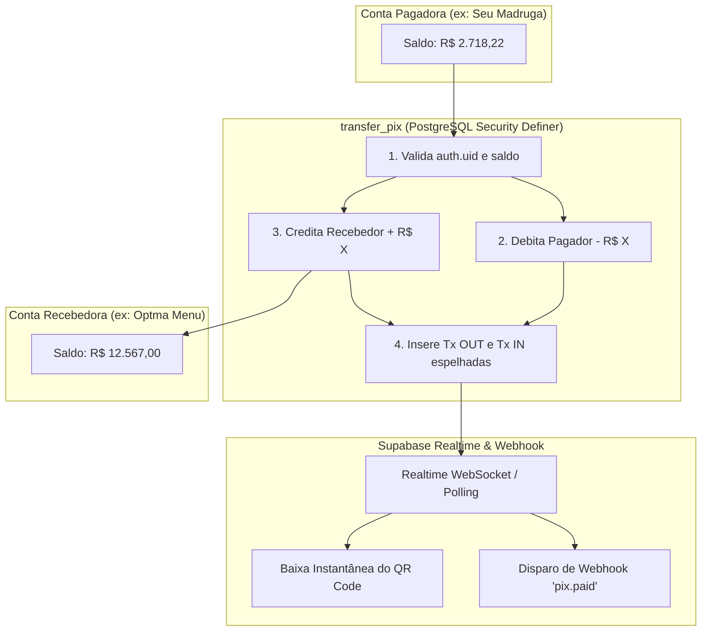

# Documentação Completa do Sistema Pix Sandbox — OptmaPay Dev Bank

> **Ambiente:** Sandbox / Simulador de Internet Banking  
> **Regra de Ouro:** `"realMoney": false` | `"environment": "sandbox"`  
> **Versão:** 1.0.0  
> **Data de Atualização:** 30/08/2026  

---

## 1. Visão Geral

O módulo **Pix do OptmaPay Sandbox** foi desenvolvido para simular com fidelidade máxima o ecossistema do Banco Central do Brasil (Pix P2P, Pix Cobrança Dinâmica, Baixa Automática de Pedidos e Mecanismo Especial de Devolução/Estorno).

Ele serve como infraestrutura central de testes para checkout de vendas online, integração de e-commerces, disparos de webhooks e conciliação bancária entre contas Pessoa Física (PF) e Pessoa Jurídica (PJ).

---

## 2. Arquitetura de Dados & Segurança no PostgreSQL (Supabase)

### 2.1. Funções RPC Atômicas (PostgreSQL)

#### `public.transfer_pix`
Executa transferências entre contas diferentes de forma **atômica e transacional**.
- **Segurança:** `SECURITY DEFINER` com `search_path = public, pg_temp`.
- **Validação de Autorização:** Garante que o usuário logado só pode movimentar fundos se `auth.uid() = sender_account.user_id`.
- **Prevenção de RLS 403:** Permite creditar o saldo na conta de destino e inserir a transação de crédito sem violação de permissão de escrita cruzada.
- **Resultado:** Retorna os IDs das duas transações espelhadas (`transaction_out_id` e `transaction_in_id`), nome das contrapartes e referência da operação.

#### `public.refund_pix`
Executa o **Mecanismo de Devolução (Estorno) Pix** total ou parcial com controle acumulado de saldo remanescente.
- **Validação de Direção:** Somente transações de crédito (`direction = 'in'`) podem ser devolvidas pelo titular da conta recebedora.
- **Controle de Saldo Restante:** Deduz do saldo original (`amount - refunded_amount`). Impede estornos superiores ao saldo ainda não devolvido.
- **Atrelamento:** Grava `related_transaction_id` nas transações espelhadas de estorno apontando diretamente para o ID da transação original.
- **Status Automático:** Quando o valor total for devolvido (`refunded_amount >= amount`), a transação original recebe o status `refunded`.

---

## 3. Padrão de Payloads e Formatos de Instrução Pix

O sistema suporta e interpreta 4 formatos de chave e instrução:

| Formato | Exemplo | Descrição |
| :--- | :--- | :--- |
| **Instrução OptmaPay** | `OPTMAPAY://PIX/v1?to=email@exemplo.com&amount=28.00&ref=TXN-12345678&desc=Pedido+102&env=sandbox&ts=1788063523` | Payload proprietário completo com valor, contraparte, ID de transação e timestamp de expiração |
| **Padrão BR Code / EMV** | `00020126580014br.gov.bcb.pix...540528.005802BR59...62070503***6304...` | Padrão EMV internacional utilizado pelo Banco Central |
| **Prefixo PIX Simples** | `PIX:minhachave@dominio.com` | Formato padrão de atalhos e links diretos |
| **Chave Pura** | `email@dominio.com`, `123.456.789-00`, `12.345.678/0001-90`, `+5511999999999` ou UUID da conta | Identificador direto de conta bancária |

---

## 4. Fluxos de Funcionamento Detalhados

### Fluxo 1: Transferência / Envio de Pix (P2P)
1. O usuário acessa **Área Pix** ➔ **Pagar / Enviar**.
2. Cola uma Chave Pix, código `OPTMAPAY://PIX/v1?...` ou escaneia um QR Code pela câmera.
3. O sistema auto-preenche o valor cobrado e a descrição (se presentes na instrução).
4. O usuário clica em **"Confirmar e Transferir Pix Agora"**.
5. O débito e o crédito ocorrem simultaneamente no PostgreSQL via `transfer_pix`.
6. Abre-se o **Comprovante de Transferência Pix** com autenticação digital, valor, dados de origem e destino (sem expor o saldo da outra conta).

---

### Fluxo 2: Cobrança com Valor e Baixa Automática em Tempo Real
1. O comerciante (PJ ou PF) acessa **Área Pix** ➔ **Cobrança com Valor**.
2. Preenche apenas o **Valor Cobrado (R$)** (a descrição é opcional e o `ID da Transação` é gerado aleatoriamente, ex: `TXN-83537252`).
3. O sistema gera o QR Code com **validade estrita de 10 minutos** e exibe o cronômetro regressivo (`MM:SS`).
4. **Monitoramento Ativo:** O front-end monitora o pagamento via Supabase Realtime WebSocket e polling inteligente de alta frequência (500ms).
5. Assim que o cliente realiza a transferência de qualquer dispositivo:
   - A tela do comerciante transiciona imediatamente para `🟢 PIX PAGO COM SUCESSO! (Baixa Realizada)`.
   - O botão de cópia é travado com `✓ Cobrança Liquidada (Código Desativado)` para evitar pagamentos duplicados.
   - O evento dispara os webhooks cadastrados para a conta do recebedor.

---

### Fluxo 3: Gestão de Cobranças Emitidas ("Minhas Cobranças")
1. A aba **Minhas Cobranças** lista todas as cobranças geradas pela conta.
2. Cada cobrança possui status dinâmico e reconciliado em tempo real:
   - 🟢 **Paga:** Identifica quem pagou, valor, data e hora da quitação. Código de cópia bloqueado.
   - 🟡 **Aguardando Pagamento:** Exibe valor, horário de criação e botão para copiar/visualizar.
   - ⚪ **Expirada:** Cobrança não paga após 10 minutos. Código travado com ícone de cadeado.

---

### Fluxo 4: Devolução / Estorno Pix (Mecanismo Especial)
1. No **Extrato de Transações da Dashboard** ou no **Extrato Exclusivo de Pix**:
2. Qualquer Pix recebido (`direction = 'in'`) que possua saldo reembolsável exibe o badge clicável:
   - Se nenhuma devolução ocorreu: `Clique para Devolver`.
   - Se já houve devolução parcial: `Devolver Restante (R$ XX,XX)`.
3. Ao clicar, o modal calcula:
   - **Valor Original:** R$ 13,00
   - **Já Devolvido:** R$ 3,00
   - **Saldo Restante Disponível:** R$ 10,00
4. O usuário escolhe entre **Devolver Saldo Restante** ou digitar um valor parcial (travado no máximo disponível).
5. O estorno debita da conta recebedora e credita na conta pagadora original.
6. **Desativação Total:** Quando 100% do valor for devolvido, a opção de estorno é **removida**, exibindo o badge fixo `Devolvido Integralmente`.

---

### Fluxo 5: Extrato Bancário da Conta com Evolução de Saldo
1. O Extrato da Conta ([src/pages/Dashboard.tsx](file:///d:/OptmaIdea/optmapay/src/pages/Dashboard.tsx)) permite filtrar por:
   - **Semana Atual** (últimos 7 dias)
   - **Quinzena Atual** (últimos 15 dias)
   - **Mês Atual** (últimos 30 dias)
   - **Personalizado** (Data inicial e final, com trava de 60 dias da política de retenção).
2. **Agrupamento Diário:**
   - Para cada dia:
     - **Saldo Anterior:** Saldo que a conta tinha no início do dia.
     - **Entradas do Dia (+R$)** e **Saídas do Dia (-R$)**.
     - **Saldo do Dia (Final):** Saldo consolidado no encerramento daquele dia.
   - Cada linha individual exibe o **Saldo após** o lançamento.

---

### Fluxo 6: Comprovante de Transferência Nativo (Sem Dependências de Terceiros)
1. Ao concluir uma transferência Pix, abre-se o modal de comprovante.
2. Contém:
   - Autenticação Digital Única (ex: `TXN-44168614`)
   - Nome e Chave Pix do Pagador e do Recebedor
   - Data, Hora e Valor em destaque
   - Ambiente: `Sandbox (realMoney: false)`
3. Botão **"Copiar Texto"** (gera texto pronto para WhatsApp ou e-mail).
4. Botão **"Imprimir / Salvar PDF"** (utiliza o motor de impressão nativo do navegador via CSS `@media print`).

---

## 5. Matriz de Estados e Regras de Bloqueio

| Cenário | Status no Sistema | Comportamento do QR Code / Copia e Cola | Possibilidade de Devolução |
| :--- | :--- | :--- | :--- |
| **Cobrança Gerada (< 10 min)** | `Aguardando Pagamento` | Ativo para cópia e leitura | N/A (Ainda não paga) |
| **Cobrança Paga** | `Paga` | Bloqueado (`✓ Cobrança Liquidada`) | Permitida (100% ou parcial) |
| **Cobrança Expirada (> 10 min sem quitação)** | `Expirada` | Bloqueado (`Código Desativado`) | N/A (Não liquidada) |
| **Pix Recebido (Sem devoluções)** | `completed` | Concluído | Devolução Total (100%) ou Parcial |
| **Pix Recebido (Devolução Parcial efetuada)** | `completed` | Concluído | Devolução do Saldo Restante ou Parcial |
| **Pix Recebido (100% Devolvido)** | `refunded` | Concluído | **Bloqueada** (`Devolvido Integralmente`) |

---

## 6. Histórico de Migrations SQL Relacionadas ao Pix

- [`20260829000000_initial_schema.sql`](file:///d:/OptmaIdea/optmapay/supabase/migrations/20260829000000_initial_schema.sql): Estrutura base de `accounts` e `transactions`.
- [`20260830000000_fix_transfer_pix_security_definer.sql`](file:///d:/OptmaIdea/optmapay/supabase/migrations/20260830000000_fix_transfer_pix_security_definer.sql): Execução atômica cross-account de transferências Pix sob RLS.
- [`20260830000001_realtime_and_advisors_fix.sql`](file:///d:/OptmaIdea/optmapay/supabase/migrations/20260830000001_realtime_and_advisors_fix.sql): `REPLICA IDENTITY FULL` para disparo imediato de WebSockets.
- [`20260830000002_revoke_anon_and_optimize.sql`](file:///d:/OptmaIdea/optmapay/supabase/migrations/20260830000002_revoke_anon_and_optimize.sql): Revogação de acesso anônimo das funções financeiras.
- [`20260830000003_link_pix_refunds_and_balance.sql`](file:///d:/OptmaIdea/optmapay/supabase/migrations/20260830000003_link_pix_refunds_and_balance.sql): Atrelamento de transações de estorno (`related_transaction_id`) e controle de saldo remanescente (`refunded_amount`).
